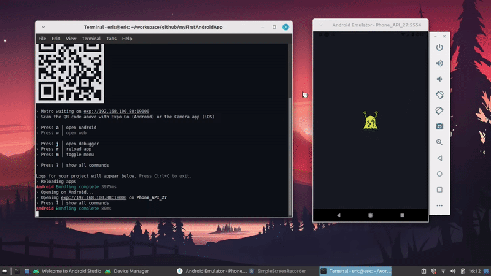

#### My First Android App 🚀


<p>Meu primeiro aplicativo android, que foi desenvolvido com <strong>React Native, Expo, Fetch, <a href="https://rickandmortyapi.com/">Rick and Morty API</a></strong> e entre outros.</p>




#### Executando

```sh

# Clone repository
$ git clone https://github.com/EricNeves/myFirstAndroidApp.git

# Install dependencies
$ cd myFirstAndroidApp && npm install

# Run on android emulator
$ npm run android 

```

#### Tools

   * Expo (npx create-expo-app project)
   * Javascript
     * React Native
     * Fetch API 
   * Rick and Morty API
   

#### License 


